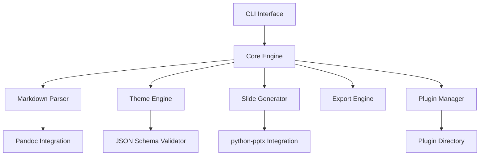

# MarkDeck

A sophisticated command-line tool that converts Markdown files into professional PowerPoint presentations with optional PDF export.

[](https://opensource.org/licenses/MIT)
[](https://www.python.org/downloads/)
[](https://github.com/psf/black)

## Features

- **Markdown to PowerPoint**: Convert Markdown files to professional PPTX presentations
- **PDF Export**: Optional PDF export for sharing and printing
- **Comprehensive Theming**: JSON-based theming with full PowerPoint object model access
- **Speaker Notes**: Extract speaker notes from Markdown comment blocks
- **Plugin Architecture**: Extensible plugin system for custom functionality
- **Pandoc Integration**: Robust Markdown parsing with Pandoc
- **CI/CD Ready**: Golden-file testing and automated validation
- **Cross-Platform**: Works on Windows, macOS, and Linux

## Quick Start

### Installation

```bash
# Install from PyPI (when available)
pip install markdeck

# Or install from source
git clone https://github.com/rtcok/markdeck.git
cd markdeck
pip install -e .
```

### Basic Usage

```bash
# Convert a Markdown file to PowerPoint
markdeck presentation.md

# Use a specific theme
markdeck presentation.md --theme corporate

# Export to both PPTX and PDF
markdeck presentation.md --pdf

# Specify output location
markdeck presentation.md --output slides.pptx
```

### Example Markdown

Create a file called `presentation.md`:

```markdown
# Welcome to MarkDeck
## Converting Markdown to PowerPoint Made Easy

<!-- Speaker note: This is the opening slide. Welcome the audience and introduce MarkDeck. -->

---

## Key Features

- **Easy to use**: Simple Markdown syntax
- **Professional output**: Beautiful PowerPoint presentations
- **Flexible theming**: Customize the look and feel
- **Speaker notes**: Add notes for presenters

<!-- Speaker note: Highlight the main benefits of using MarkDeck. -->

---

## Getting Started

1. Write your content in Markdown
2. Choose a theme (or create your own)
3. Run MarkDeck to generate your presentation
4. Present with confidence!

<!-- Speaker note: Walk through the simple process step by step. -->
```

## Advanced Usage

### Custom Themes

Create custom themes using JSON configuration:

```bash
# Validate a theme
markdeck --validate-theme mytheme.json

# Use a custom theme directory
markdeck presentation.md --theme-dir ./themes --theme custom
```

### Configuration File

Create a `markdeck.yaml` configuration file:

```yaml
# Default settings
theme: corporate
output_format: pptx
export_pdf: false

# Theme settings
theme_directories:
  - ./themes
  - ~/.markdeck/themes

# Plugin settings
plugins:
  enabled: true
  directories:
    - ./plugins
    - ~/.markdeck/plugins
```

### Plugin Development

Extend MarkDeck with custom plugins:

```python
# plugins/my_plugin.py
from markdeck.plugins.base import MarkDeckPlugin

class MyPlugin(MarkDeckPlugin):
    name = "my_plugin"
    version = "1.0.0"
    
    def process(self, data):
        # Custom processing logic
        return data
```

## Project Structure

```
markdeck/
├── markdeck/              # Main package
│   ├── cli/               # Command-line interface
│   ├── core/              # Core processing engine
│   ├── parsers/           # Markdown parsing
│   ├── themes/            # Theming system
│   ├── generators/        # Slide generation
│   ├── exporters/         # Export functionality
│   ├── plugins/           # Plugin system
│   ├── config/            # Configuration management
│   └── utils/             # Utilities
├── tests/                 # Test suite
├── docs/                  # Documentation
├── examples/              # Example files
└── schemas/               # JSON schemas
```

## Dependencies

### Core Dependencies

- **Pandoc**: Markdown parsing and AST processing
- **python-pptx**: PowerPoint file generation
- **jsonschema**: Theme validation
- **pydantic**: Data validation and settings
- **rich**: Enhanced CLI output

### Optional Dependencies

- **PDF Export**: `unoconv` or `python-docx2pdf`
- **Visual Testing**: `opencv-python` for image comparison
- **Development**: `pytest`, `black`, `mypy`, `ruff`

## Architecture

MarkDeck follows a modular architecture with clear separation of concerns:



### Key Components

1. **CLI Interface**: Command parsing and user interaction
2. **Core Engine**: Orchestrates the conversion process
3. **Markdown Parser**: Pandoc integration and AST processing
4. **Theme Engine**: JSON theme processing and validation
5. **Slide Generator**: PowerPoint generation with python-pptx
6. **Export Engine**: Multi-format export capabilities
7. **Plugin Manager**: Directory-based plugin system

## Theming System

MarkDeck provides comprehensive theming support through JSON configuration:

### Theme Structure

```json
{
  "schema_version": "1.0",
  "metadata": {
    "name": "My Theme",
    "version": "1.0.0",
    "author": "Your Name"
  },
  "master_slides": {
    "title": { /* Title slide layout */ },
    "content": { /* Content slide layout */ },
    "section": { /* Section slide layout */ }
  },
  "styling": {
    "fonts": { /* Font specifications */ },
    "colors": { /* Color palette */ },
    "spacing": { /* Spacing rules */ }
  },
  "objects": {
    "text_boxes": { /* Text box styling */ },
    "images": { /* Image handling */ },
    "tables": { /* Table styling */ }
  }
}
```

### Built-in Themes

- **Corporate**: Professional business theme
- **Academic**: Clean academic presentation theme
- **Minimal**: Simple, distraction-free theme

## Testing

MarkDeck includes comprehensive testing with multiple validation approaches:

### Golden File Testing

```bash
# Run golden file tests
python -m pytest tests/golden/

# Update golden files
python tests/golden/runner.py --update
```

### Visual Regression Testing

```bash
# Run visual tests
python -m pytest tests/visual/

# Generate visual diffs
python tests/visual/compare.py --diff
```

### Performance Testing

```bash
# Run performance benchmarks
python -m pytest tests/performance/

# Generate performance reports
python tests/performance/benchmark.py --report
```

## Development

### Setting up Development Environment

```bash
# Clone the repository
git clone https://github.com/rtcok/markdeck.git
cd markdeck

# Create virtual environment
python -m venv venv
source venv/bin/activate  # On Windows: venv\Scripts\activate

# Install development dependencies
pip install -e ".[dev]"

# Install pre-commit hooks
pre-commit install
```

### Running Tests

```bash
# Run all tests
pytest

# Run specific test categories
pytest tests/unit/
pytest tests/integration/
pytest -m "not slow"  # Skip slow tests

# Run with coverage
pytest --cov=markdeck --cov-report=html
```

### Code Quality

```bash
# Format code
black markdeck/ tests/

# Lint code
ruff check markdeck/ tests/

# Type checking
mypy markdeck/
```

## Contributing

We welcome contributions! Please see our [Contributing Guide](CONTRIBUTING.md) for details.

### Development Workflow

1. Fork the repository
2. Create a feature branch
3. Make your changes
4. Add tests for new functionality
5. Ensure all tests pass
6. Submit a pull request

### Code Standards

- Follow PEP 8 style guidelines
- Use type hints for all functions
- Write comprehensive docstrings
- Include unit tests for new features
- Update documentation as needed

## Roadmap

### Version 1.0 (Current)

- [x] Core Markdown to PowerPoint conversion
- [x] Basic theming system
- [x] CLI interface
- [x] Plugin architecture foundation
- [ ] Comprehensive testing suite
- [ ] Documentation completion

### Version 1.1 (Planned)

- [ ] Advanced animation support
- [ ] Interactive slide elements
- [ ] Web-based theme editor
- [ ] Cloud theme marketplace
- [ ] Real-time preview server

### Version 2.0 (Future)

- [ ] Collaborative editing
- [ ] Version control integration
- [ ] REST API
- [ ] Web interface
- [ ] Enterprise features

## License

This project is licensed under the MIT License - see the [LICENSE](LICENSE) file for details.

## Acknowledgments

- **Pandoc**: For excellent Markdown parsing capabilities
- **python-pptx**: For PowerPoint file generation
- **Microsoft**: For the Office Open XML specification

## Support

- **Documentation**: [markdeck.readthedocs.io](https://markdeck.readthedocs.io)
- **Issues**: [GitHub Issues](https://github.com/rtcok/markdeck/issues)
- **Discussions**: [GitHub Discussions](https://github.com/rtcok/markdeck/discussions)

---

*Made with ❤️ by the MarkDeck team*
