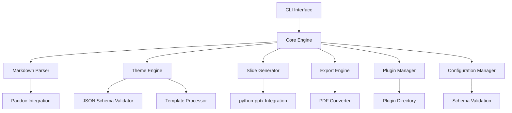
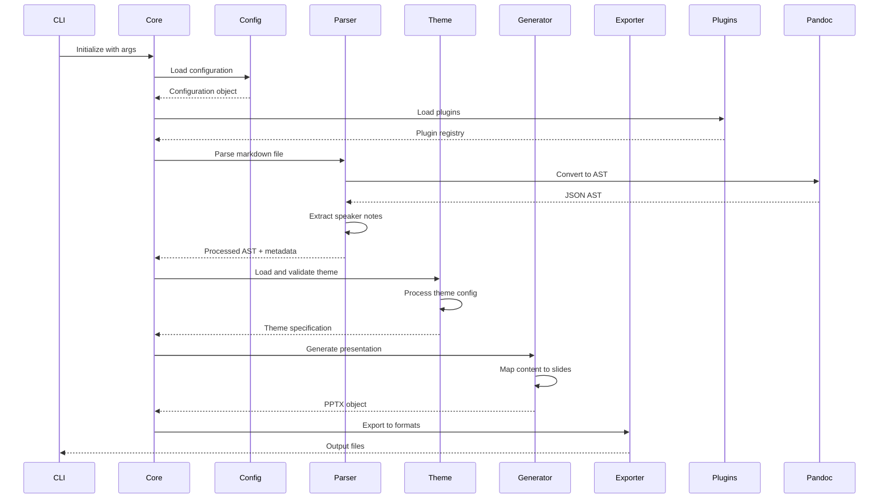

# MarkDeck Architecture Documentation

## Overview

MarkDeck is a sophisticated command-line tool that converts Markdown files into professional PowerPoint presentations with optional PDF export. The architecture is designed for extensibility, maintainability, and comprehensive theming support.

## Core Architecture

### High-Level Components



### Component Responsibilities

#### 1. CLI Interface (`markdeck.cli`)
- Command parsing and validation
- User interaction and feedback
- Progress reporting
- Error handling and user-friendly messages

#### 2. Core Engine (`markdeck.core`)
- Orchestrates the entire conversion process
- Manages the processing pipeline
- Coordinates between components
- Handles exceptions and error recovery

#### 3. Markdown Parser (`markdeck.parsers`)
- Integrates with Pandoc for robust parsing
- Extracts speaker notes from comment blocks
- Processes AST for slide mapping
- Handles custom markdown extensions

#### 4. Theme Engine (`markdeck.themes`)
- Validates JSON theme schemas
- Processes theme configurations
- Manages template inheritance
- Supports programmatic theme generation

#### 5. Slide Generator (`markdeck.generators`)
- Maps markdown elements to slide layouts
- Integrates with python-pptx
- Manages slide content and formatting
- Handles animations and transitions

#### 6. Export Engine (`markdeck.exporters`)
- Handles multiple output formats
- PDF conversion support
- Format-specific optimizations
- Batch processing capabilities

#### 7. Plugin Manager (`markdeck.plugins`)
- Directory-based plugin discovery
- Plugin lifecycle management
- Interface validation
- Error isolation

#### 8. Configuration Manager (`markdeck.config`)
- Settings management
- Schema validation
- Environment-specific configurations
- Default value handling

## Data Flow Architecture

### Processing Pipeline



### Data Structures

#### Parsed Content Structure
```python
@dataclass
class ParsedContent:
    ast: Dict[str, Any]           # Pandoc AST
    metadata: Dict[str, Any]      # Document metadata
    speaker_notes: Dict[int, str] # Slide number -> notes
    structure: List[SlideInfo]    # Slide structure info
```

#### Theme Configuration
```python
@dataclass
class ThemeConfig:
    metadata: ThemeMetadata
    master_slides: Dict[str, SlideLayout]
    slide_types: Dict[str, str]
    styling: StyleConfig
    objects: ObjectConfig
    programmatic: ProgrammaticConfig
```

## Plugin Architecture

### Plugin Types

1. **Parser Plugins**: Extend markdown parsing capabilities
2. **Generator Plugins**: Add custom slide layouts and content types
3. **Exporter Plugins**: Support additional output formats
4. **Theme Plugins**: Custom theme processors and generators

### Plugin Interface

```python
from abc import ABC, abstractmethod

class MarkDeckPlugin(ABC):
    """Base plugin interface"""
    
    @property
    @abstractmethod
    def name(self) -> str:
        """Plugin name"""
        pass
    
    @property
    @abstractmethod
    def version(self) -> str:
        """Plugin version"""
        pass
    
    @abstractmethod
    def initialize(self, config: Dict[str, Any]) -> None:
        """Initialize plugin with configuration"""
        pass
    
    @abstractmethod
    def process(self, data: Any) -> Any:
        """Process data through plugin"""
        pass
```

### Plugin Discovery

Plugins are discovered from:
1. `~/.markdeck/plugins/` (user plugins)
2. `./plugins/` (project plugins)
3. Package entry points (installed plugins)

Each plugin directory should contain:
- `plugin.json` - Plugin metadata
- `__init__.py` - Plugin implementation
- Optional dependencies and resources

## Theme System Architecture

### Comprehensive Theming Support

The theme system provides full PowerPoint object model access:

#### Theme Schema Structure
```json
{
  "schema_version": "1.0",
  "metadata": {
    "name": "Theme Name",
    "version": "1.0.0",
    "author": "Author",
    "description": "Theme description"
  },
  "master_slides": {
    "title": {
      "layout": "title_slide",
      "placeholders": { /* Placeholder definitions */ },
      "background": { /* Background settings */ }
    }
  },
  "slide_types": {
    "mapping": {
      "header1": "title",
      "header2": "section",
      "content": "content"
    }
  },
  "styling": {
    "fonts": { /* Font specifications */ },
    "colors": { /* Color palette */ },
    "spacing": { /* Spacing rules */ },
    "animations": { /* Animation definitions */ }
  },
  "programmatic": {
    "scripts": {
      "pre_process": "def pre_process(slide, data): ...",
      "post_process": "def post_process(slide, data): ..."
    }
  }
}
```

#### Theme Processing Pipeline

1. **Schema Validation**: JSON schema validation
2. **Theme Compilation**: Process programmatic elements
3. **Template Generation**: Create slide templates
4. **Runtime Application**: Apply theme during generation

## Testing Architecture

### Golden File Testing

Structure:
```
tests/golden/
├── inputs/
│   ├── basic.md
│   ├── complex.md
│   └── speaker_notes.md
├── expected/
│   ├── basic/
│   │   ├── slides.pptx
│   │   ├── content.json
│   │   └── metadata.json
│   └── complex/
├── themes/
│   ├── test_theme.json
│   └── minimal_theme.json
└── runner.py
```

### Testing Strategy

1. **Content Validation**: Extract and compare slide content
2. **Layout Validation**: Verify slide layouts and positioning
3. **Metadata Validation**: Check presentation properties
4. **Visual Regression**: Image-based comparison
5. **Performance Benchmarking**: Processing time and memory usage

### CI/CD Integration

- Automated test execution on PR/push
- Performance regression detection
- Visual diff reporting
- Cross-platform testing (Windows, macOS, Linux)

## Integration Points

### Pandoc Integration
- JSON AST processing
- Custom filter support
- Extension handling
- Error propagation

### python-pptx Integration
- Object model wrapping
- Template management
- Format preservation
- Performance optimization

### PDF Export
- LibreOffice headless conversion
- Format-specific optimizations
- Batch processing support
- Quality settings

## Security Considerations

### Theme Security
- Sandboxed programmatic execution
- Input validation for theme scripts
- Resource limitation for theme processing
- Safe eval environment for expressions

### Plugin Security
- Plugin validation and signing
- Isolated execution environments
- Permission-based access control
- Resource usage monitoring

## Performance Optimization

### Processing Optimization
- Lazy loading of themes and plugins
- Caching of parsed content
- Parallel processing for batch operations
- Memory-efficient large file handling

### Export Optimization
- Streaming export for large presentations
- Format-specific optimizations
- Compression settings
- Background processing support

## Extension Points

### Custom Slide Types
Plugins can register custom slide types:
```python
@register_slide_type("code_demo")
class CodeDemoSlide(BaseSlideType):
    def generate(self, content, theme):
        # Custom slide generation logic
        pass
```

### Custom Exporters
Support for additional output formats:
```python
@register_exporter("html")
class HTMLExporter(BaseExporter):
    def export(self, presentation, output_path):
        # HTML export logic
        pass
```

## Future Enhancements

### Planned Features
- Real-time preview server
- Interactive slide editor
- Cloud theme marketplace
- Collaborative editing support
- Version control integration

### API Evolution
- RESTful API for programmatic access
- Webhook support for CI/CD integration
- GraphQL API for complex queries
- WebSocket support for real-time updates

## Conclusion

This architecture provides a solid foundation for MarkDeck's growth while maintaining flexibility and extensibility. The modular design allows for independent development and testing of components, while the plugin system enables community contributions and customizations.